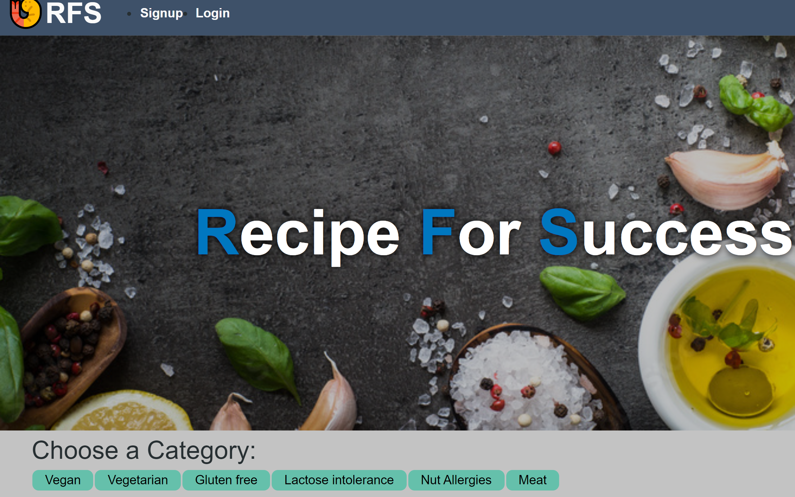

## Project: Recipe for Success (RFS)

## Table of Contents

1. [Description](#description)
2. [Technologies](#technologies)
3. [Installation](#installation)
4. [Contributors](#contributors)
5. [Challenges](#challenges)

## Description

The Recipe for Success (RFS) brings together a plethora of recipies covering variety of needs. Here, food enthusiasts can browse and buy the pay-per-view recipies. The recipeis are catagorized into vegan, vegetarian and several free-from sections to facilitate the user choice.

The website opens with a navigation bar displaying a) the RFS home button, b) options to sign up or login and c) a button for the cart. 

Below the navigation bar, different recipe catagories are presented as links. Below these catagories, all the recipies are displayed. Each recipe is presented with a display image that doubles as a link to the recipe and a link to add it to the cart. 

Clicking on any of the categories will sort and list the category-specific recipies. 

Clicking on the recipe images will open the recipe page, wherein a brief description of the recipe, price, options to add to or remove from the cart and an image of the dish are displayed. The users need to pay-per-view for viewing full recipe. 

Upon clicking the 'Add to Cart' button, the recipe is added to the cart, and the link to the cart is activated. Upon clicking the cart button, a window is displayed with the in-cart item details (name, price and quantity). 

The users need to log into the website to check out the cart and view the full recipies.

We will soon be adding the cooking videos for each recipe to enhace the user experience. 

Comeback and enjoy our videos. 

### Screenshots and links:

 Deployed link:  https://recipe-for-success.herokuapp.com/

 

## Technologies

A list of technologies used in this project:

 * apollo-server-express : ^3.6.2,
 * bcrypt: ^4.0.1,
 * express: ^4.17.2,
 * graphql: ^16.3.0,
 * jsonwebtoken: ^8.5.1,
 * mongoose: ^6.1.10,
 * stripe: ^8.67.0
 * jwt-decode: ^2.2.0,
 * react: ^16.13.1,
 * react-dom: ^16.13.1,
 * react-redux: ^7.2.0,
 * react-router-dom: ^6.2.1,
 * react-scripts: ^4.0.2,
 * redux": ^4.0.5

## Installation

The following commands were used in the installation and execution of this application. 

- git clone AlastairHafield/Recipe-For-Success.git 
- cd ../path/to/the/file
- npm install
- npm run build
- npm run seed
- npm run develop

## Contributors

 * AlastairHafield
 * Veera Pagadala
 * Sophia Atlaf
 * India Taylor

## Challenges

In the future, 
- we are keen to incorporate cooking videos for each recipe and explain the nutitional values. and
- crowd-sourcing of the database - users will be allowed to add and update the recipies. 

